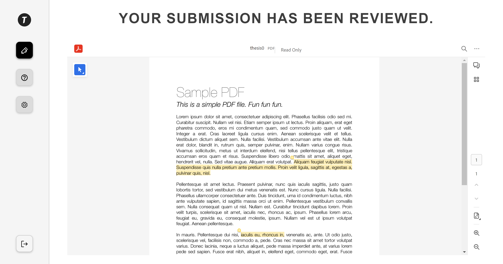

# Developing an Annotation Tool to train an LLM to provide automatic feedback on students theses

## Name
Developing an Annotation Tool, used by professors to provide feedback to students' theses and utilize this feedback to train a LLM in order to provide automatic feedback.

## Description
This application should provide professors with a way to annotate PDF files, which represent students' theses. They can make use of feedback codes, which are short, predefined codes associated to some standard feedback. The professors have a dashboard, in which they can see all their assigned submissions, the last edited date of the document, the group name in which the student who uploaded the respective submission is part of, and whether the file was already submitted by the professors. Once they are done, an admin can use the parsing functionality, which retrieves the text from PDF files and applies some preprocessing techniques, in order to create an appropriate input for a Large Language Model, which will be trained in the future.

## Installation
Our application does not require any local installation, since all functionality is featured on a website. The backend logic of the application should be ran on a remote server, while the frontend of the application should be uploaded to some domain.

## Usage
The first step of the tool involves logging in to your account. Since this is a private tool, which should be only used with the scope of providing feedback to Research Project students, you cannot create your own account on the tool. Instead, you will have an account automatically created once theses have been imported to the tool. 

#### For supervisors

The supervisors will have access to a dashboard, which should showcase all reports associated to them.

The supervisor can click on any of them, in which case they will be taken to the "Annotating page". There, they can freely modify the file and make use of feedback codes, which will always be displayed on the right. After they are done, they can choose to submit the file by clicking on the "Submit" button at the top of the page.

Navigation between files can be done either through the dashboard, by selecting the desired file, or through the annotation page, by clicking on either the "previous", or "next" buttons, which will show the next file on the list.

Supervisors also have access to an account settings page, in which they can do multiple things:
- Firstly, they can change the password to their account. Since the accounts are automatically generated, the initial password may be hard to remember, thus someone would like to set an easier one to remember.
- Secondly, thay can choose to download all associated submissions. This allows them to receive a zip file containing all submissions that they are responsible for annotating. With this feature, we ensure that they are all accessible in one place, and can easily be uploaded back to Brightspace, if necessary.
- Lastly, if they want to erase their personal data from our tool, or if they do not want to be associated with it any more, they can choose to delete their accounts.

#### For admins

Administrators have access to two more pages. First one represents the course managing settings, in which an administrator will be allowed to upload three files: A file containing all student submissions, generated by Brightspace, a file containing a list of students, and the groups they are enrolled in, and a file containing a list of supervisors, and the groups they are responsible for. After uploading these three files, if they are in an appropriate format, they should be recognized by our tool, and all data should be imported accordingly.

On this page, they can also download all parsed files. Once clicked, this button provides a zip file, containing all files in the database, after parsing them using the parsing tool. This can be used to generate the data for the Large Language Model, which should be developed in the future.

Lastly, on this page, they can also choose to delete all submissions from the database. We recommend clearing them after every course edition, such that the supervisors's dashboards don't get too crowded.

The other page they have access to is the annotation codes page. Here, they can add/edit/delete feedback codes, which are the short codes associated to some predefined feedback, and also available to annotators at all times. This allows for more situations for predefined feedback.

#### For students

Students only have access to a restricted version of the tool, which only contains the annotation page. However, they cannot access any files other than their own submissions, and they can only see them once they have been submitted by a supervisor, on our tool. Moreover, they do not have access to the feedback codes either and cannot further modify the document, as the viewer is locked into a read-only mode while a student is logged in.

However, they have access to functionality regarding changing passwords and deleting accounts.

#### General usage
In case any help is required from users, regardless of their role, all have access to a help page, which contains a contact form, answers to frequently asked questions, as well as a feedback form.

After completing these, the requests will be sent to an email address, which should be checked regularly. An answer should then be provided to the email address with which the form was completed.

## Dependencies
Our application makes use of some dependencies, which provide access to tools used to make developing easier. Some of the most important ones are the following:

**PDFBox:** We have used Apache PDFBox in order to construct our logic for parsing PDF files. It provides us with several useful methods, such as: parsing all text from a file, parsing text from a predefined region of a page, extracting annotations and creating our own files. Using these, we have managed to effectively parse PDF files, and create our own logic for applying pre-processing techniques, as requested by our client.

**Mockito & JUnit:** These dependencies are crucial towards achieving testing goals in our application. We use JUnit to compare results of methods with an expected value. Mockito is used to mock the behaviour of certain classes, so that we have more control over which functionality we want to test.

**JavaMail:** This dependency is used to ensure email functionality in our application. Currently, emailing credentials is very important, as it is the main way in which accounts are created for new users. Moreover, it ensures that we receive the contact and feedback forms.

**Spring security, Spring web security, JWT Tokens:** These dependencies allow users to authenticate themselves before they are able to perform any requests to the server. This also allows them to have different authorities, depending on their role. 

## Support
If you require any help using our website, please try accessing the pages related to instructions on the website, which feature detailed instructions on how to use the Annotation Tool. If you still require additional help, you can access the support page, which features a contact form and a section containing Frequently Answered Questions. We will ensure that we respond as soon as possible to your requests. If you require additional help, please feel free to reach out to us at e03601394@gmail.com.

If, at any point, you feel that something is not running as expected, or it takes too long to register some operations, or perhaps you have any suggestions for improvement, please use the feedback form in order to reach out to us. We will make sure to provide some responses to your requests.

## Roadmap
In the future, there are some important things which should be addressed. The first of them is using the TU Delft SSO for logging in to the application, which provides another secure way to access our application, using the credentials that you are familiar with from your other accounts associated to TU Delft.

The second thing to be done is integrating the tool with Brightspace, which would provide much easier access for professors, due to the fact that they won't have to navigate to an external tool to annotate students' theses, and would have everything accessible in one place.

Thirdly, our database is currently hosted by a free database hosting service, which is limited to 5 GB of data, and operations are relatively slow. Moreover, we do not have access to disk space, so we have to store files in the database, encoded as base 64 strings, which makes any operation involving them costly. Thus, in order to ensure proper functionality upon deployment, the database should be migrated to a more professional one, that allows storing files on disk and more overall space, in order to ensure that the application is functional in any scenario.

Lastly, this project should be deployed to an external web address. Once this is done, the security configuration should also be changed, to allow requests from the new address and port.

## Contributing
This project is open for future contribution and should be done by developers affiliated with TU Delft. The most important future contributions have been stated above, in the Roadmap section.

Our codebase consists of multiple packages, which contain classes responsible for some part of the logic of the whole project. If you want to contribute on the way we parse files, the first place you should check out is the ParsingService class, which is in the services package, which contains most of the logic used for extracting information out of PDF files and further processing it.

If, instead, you want to contribute towards adding new features to the frontend of our application, all pages accessible from our tool have been defined in the frontend package. Each page contains a html file, defining the elements on the page, a css file, responsible for styling the page and a js file, connecting the elements with appropriate functionality. If you want to create new pages, consider respecting the structure of the codebase we have worked on.

If you want to add new features to the application, which may involve altering the database, consider checking out the models package, which contains the entities from our database. Moreover, there are services responsible for modifying entities within the database, so use that functionality if you want to perform similar operations. If you decide to add new entities to the database, please follow the code structure from the repository, in order to keep it clean.

## Authors and acknowledgment
This project has been started as part of the Software Project course, from TU Delft. It has been developed over the course of 10 weeks, by a team of 5 developers, namely: Radu Vasile, Stefan Bud, Paul Stan, Rebecca Andrei, Calin Georgescu.

## Project status
The development process has stopped completely, as of 23rd June 2024.
